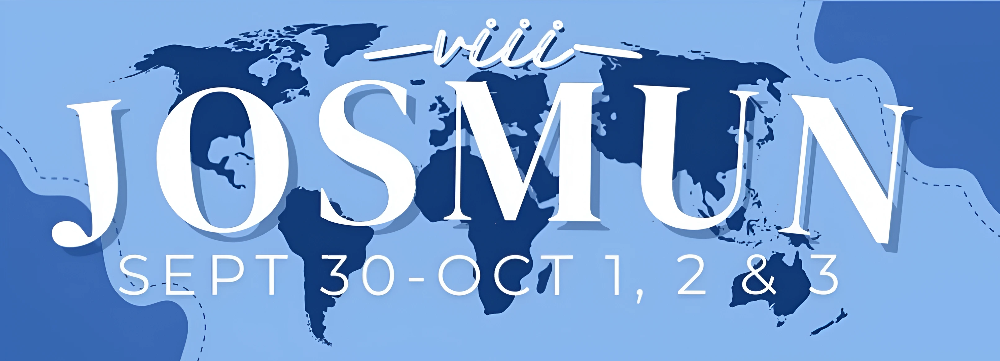
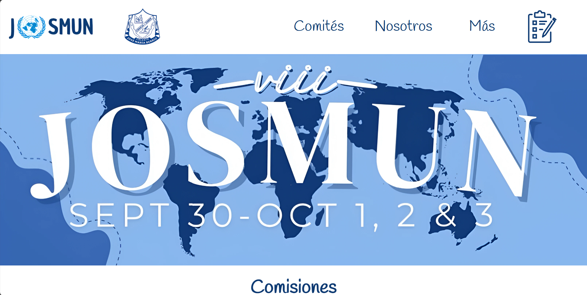
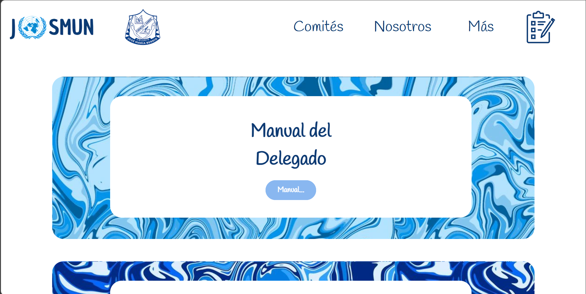
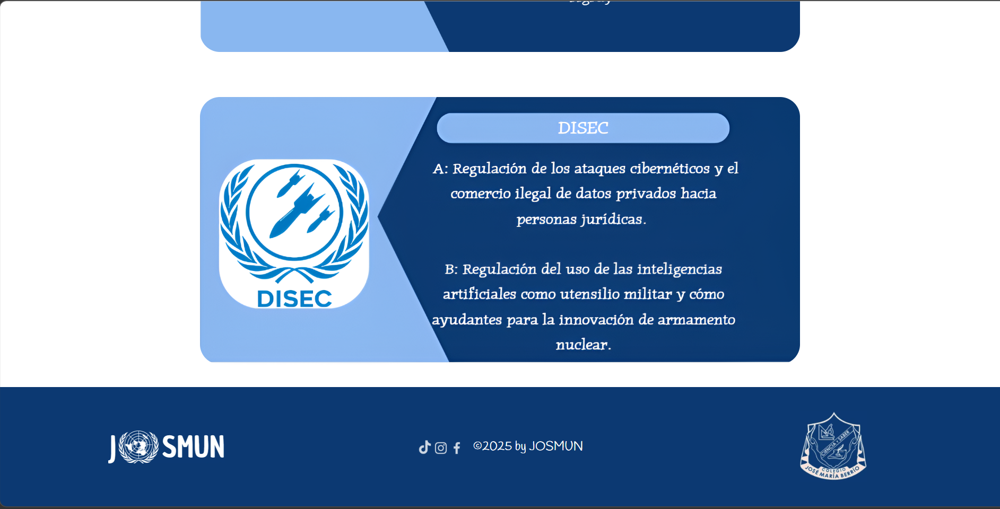

# JOSMUN – Model United Nations Website

Official website developed for the José María Berrío School Model United Nations conference.

## 🌍 Overview

This project was designed and developed to provide a centralized digital platform for the school's Model United Nations event. The website presents event information, committees, schedules, and resources for delegates.

## 🚀 Features

- Responsive design for desktop and mobile
- Structured event and committee information
- Clean and intuitive user interface
- Optimized layout and performance
- Vanilla JavaScript interactivity

## 🛠 Tech Stack

- HTML5
- CSS3
- JavaScript (Vanilla)

## 📷 Screenshots

## 🔗 Live Demo

[View Website](https://jeronimochacon.github.io/Josmun---UN-Model/)

## 📌 Project Context

This project was independently developed to support the digital presence of the school's Model United Nations conference.

## 📄 License

MIT License
